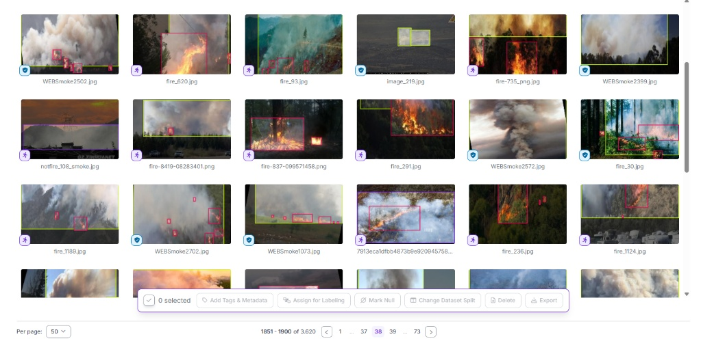

FireflAI: Autonomous Visual Detection Model (YOLO)
This repository contains the custom-trained YOLO computer vision model that serves as the "Autonomous Eye" of the FireflAI platform. Instead of relying on pre-trained generic templates, this architecture was built entirely from scratch. It detects wildfires and smoke with high precision in milliseconds, instantly triggering the autonomous tactical dispatch chain.

Dataset and Training Architecture
The training of our model did not rely on external generic sources; a unique dataset was constructed strictly following deep learning principles:

Custom Data Pool: The system was trained completely from scratch using 3,620 photos of wildfires and smoke captured under varying lighting, terrain, and weather conditions.

Precision Labeling: All flame and smoke clusters in the training set were meticulously annotated with precise bounding boxes, allowing the model to learn the physical textures and behaviors of the fire.

Visual Camouflage (Hard Negatives): A strict "Hard Negatives" strategy was applied to the dataset to prevent the model from misidentifying sunset glows, urban lights, or autumn leaves as active fires.

Field Tests and Performance
Integrated into our autonomous VTOL drone concept, this model operates with immense accuracy under harsh terrain conditions:

Installation and Quick Start
To test the model (detection_model.pt) on your local machine with a live video, simply load the necessary dependencies and execute the script:

Requirements: pip install ultralytics opencv-python requests

Quick Test Command: yolo task=detect mode=predict model=best.pt source=test_video.mp4 show=True
